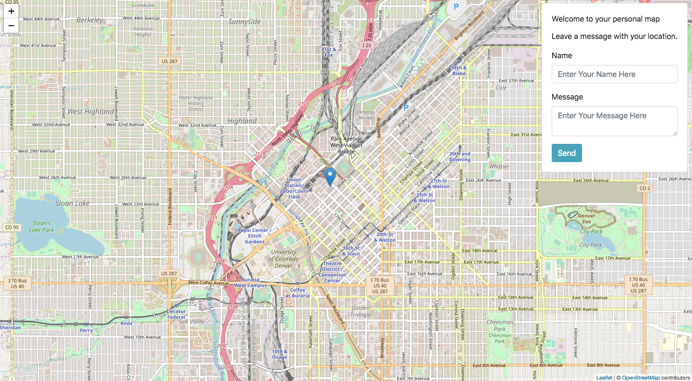

# leaflet-map

This application displays a map and a location pin that shows the user's location. This application is built with Leaflet, Node.js/Express and mongoDB.

### Starting the application:

1. clone down this repository.

2. `cd backend`, run `npm install` and run `npm run dev`.

3. `cd frontend`, run `npm install` and run `npm start`.

## Overview:

